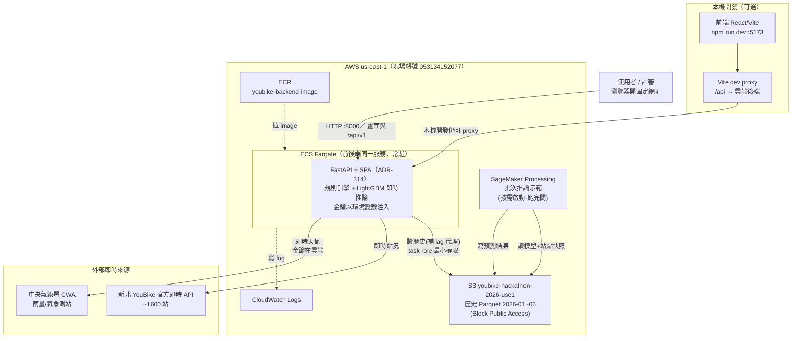

# YouBike 智慧調度系統 — 雲端架構圖（ADR-307）

競賽現場 AWS 環境（帳號 053134152077，us-east-1）。即時服務與模型生命週期分工：
**後端服務跑即時推論、SageMaker 跑批次/未來每日重訓**。

## 部署架構

## 資料流與定位

| 層 | 元件 | 職責 | 部署 |
|---|---|---|---|
| 前端 | React SPA（同源） | 六頁 UI，production 由 FastAPI 提供 | 雲端同一 NLB（本機仍可用 Vite） |
| 即時服務 | FastAPI（ECS Fargate） | 規則引擎決策、LightGBM 即時推論、外部 API 整合 | 雲端常駐 |
| 模型生命週期 | SageMaker Processing | 批次推論示範；未來每日重訓管線 | 雲端按需 |
| 資料 | S3（us-east-1） | 歷史 Parquet（訓練/lag 代理來源） | Serverless |
| 即時來源 | YouBike / CWA | 站況、天氣（金鑰在雲端後端） | 外部 |

## 關鍵設計決策（見對應 ADR）

- **金鑰雲端化**（ADR-307）：CWA 等金鑰放雲端後端環境變數，使用者從 GitHub 拉前端即可用，
  不需自備金鑰、本機關機不影響。
- **即時 vs 批次分工**（ADR-306/307）：
  - 即時單站預測在後端跑（LightGBM，毫秒級）——不需 SageMaker。
  - SageMaker 定位是「可擴展批次推論」與「未來每日重訓管線」（排程重訓、版本管理、不佔後端資源）。
  - **SageMaker 是執行平台、LightGBM 是模型演算法**，兩者互補非競爭。
- **同時段歷史代理 lag**（ADR-306）：比賽只有 1–6 月歷史、即時是 9 月，用同站同星期同時段
  歷史中位數代理 lag，讓即時預測不降級；前端誠實標示為代理。
- **規範相容**（見 `.kiro/steering/aws_competition_rules.md`）：資源在 us-east-1、S3 非公開、
  SG 只開必要埠、憑證走環境變數/role、不在雲上大規模訓練。

## 雲端資源清單（賽後清理用）

| 類型 | 名稱 |
|---|---|
| S3 bucket | youbike-hackathon-2026-use1 |
| ECR repo | youbike-backend |
| ECS cluster / service | youbike / youbike-backend |
| Task definition | youbike-backend |
| Security Group | sg-09e0635d293224992（只開 8000） |
| IAM roles | youbike-ecs-execution / youbike-ecs-task / youbike-sagemaker-exec |
| CloudWatch log group | /ecs/youbike-backend |

> 賽後關閉：`aws ecs update-service --cluster youbike --service youbike-backend --desired-count 0`
> → 刪 service / cluster / task-def；前端 `YOUBIKE_BACKEND_URL` 改回 `http://127.0.0.1:8000`。
